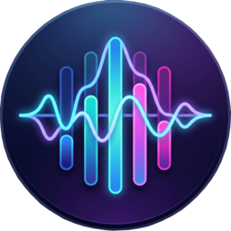
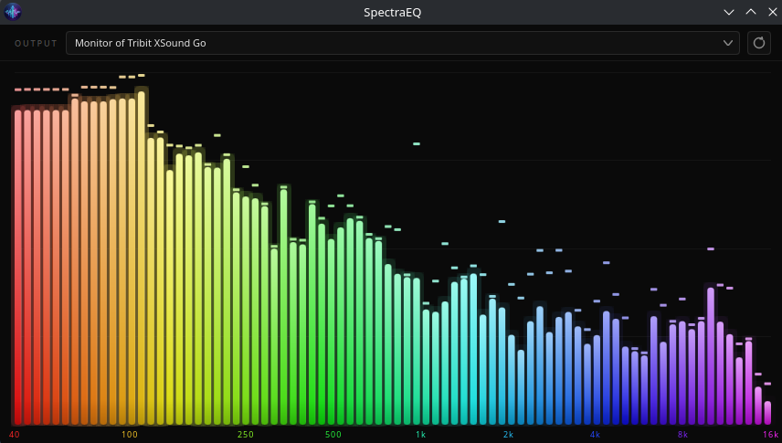

  <h3>
    
    <b>SpectraEQ</b>
  </h3>

  &nbsp;&nbsp;
  &nbsp;&nbsp;
  

SpectraEQ is a modern real-time audio spectrum analyzer and visualizer built with C++23, Qt 6 QML, and Miniaudio. It captures live system audio from selectable input devices, performs high-performance FFT analysis using a custom optimized FFT implementation, and renders a responsive frequency spectrum with logarithmic frequency scaling and perceptual dB mapping.

---

# Screenshots

  

---

# Future Work/ Improvements

- Add sample rate in the ui
- Fix the bar overflows in ui
- Check the return values of miniaudio functions and log them
- Add SIMD optimized versions of the FFT